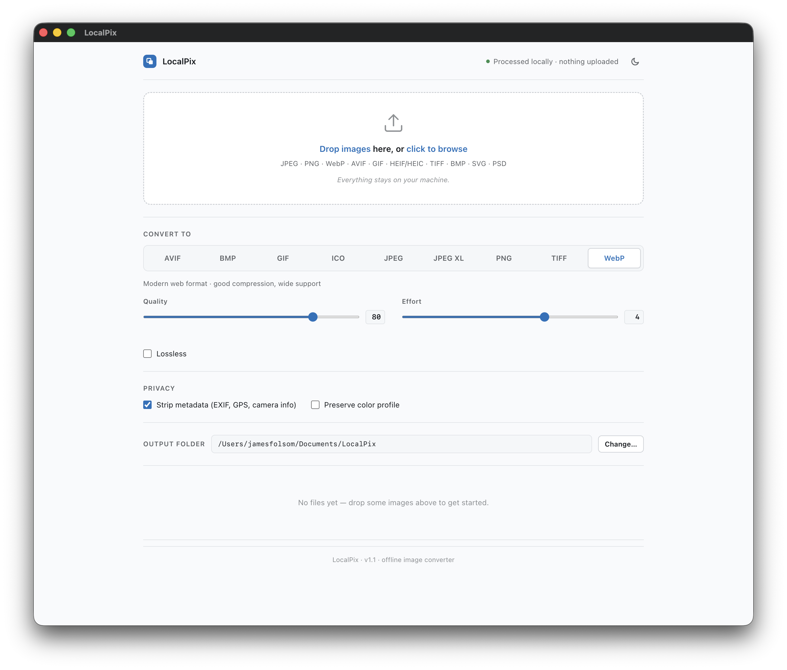

<div align="center">

# LocalPix

**A free, offline image converter for macOS and Windows.**
Convert between JPEG, PNG, WebP, AVIF, JPEG XL, JPEG 2000, OpenEXR, GIF, TIFF, BMP and ICO — without uploading anything.

[**Download the latest release →**](../../releases/latest)

<picture>
  <source media="(prefers-color-scheme: dark)" srcset="docs/screenshot-dark.png">
  <source media="(prefers-color-scheme: light)" srcset="docs/screenshot-light.png">
  
</picture>

</div>

## Why LocalPix?

- **It's local.** Your images never leave your computer. No upload, no account, no telemetry.
- **It's free and open source.** Use it for personal or commercial work; no subscriptions, no watermarks.
- **It's fast.** Native image processing — typical conversions are done in milliseconds.
- **It supports the formats you actually have.** Read 13 formats including iPhone HEIC, Photoshop PSD, SVG, PDF, JPEG 2000, and OpenEXR. Write 11, including modern ones like AVIF and JPEG XL.
- **It handles batches.** Drop a whole folder, convert everything at once. Per-format quality controls, privacy controls, a max-file-size cap, custom output folder.
- **Updates on your terms.** A manual **Check for updates** button in the footer — one anonymous version check when you click it, never in the background.

## Download

Grab the right file from the [latest release](../../releases/latest):

| Platform | Download |
|---|---|
| **macOS** (Apple Silicon — M1/M2/M3/M4) | `LocalPix-*-arm64.dmg` |
| **Windows** (Intel/AMD) | `LocalPix Setup *.exe` |

Intel Macs and Windows ARM aren't in the default release but can be built from source — see [For developers](#for-developers) below.

## Install

### macOS

1. Open the downloaded `.dmg`.
2. Drag **LocalPix** to your **Applications** folder.
3. **First launch:** macOS will show a warning that *"Apple could not verify LocalPix is free of malicious software."* Pick one of these:
   - **Right-click** (or Ctrl-click) the app → **Open** → **Open** in the next dialog. Only needed once.
   - Or open **System Settings → Privacy & Security**, scroll to the LocalPix message at the bottom, and click **Open Anyway**.

> This warning shows for any app that hasn't been signed with Apple's $99/year Developer ID. LocalPix is genuine — the warning is just macOS being cautious about software that hasn't paid for the certificate. After the first launch, you won't be prompted again.

### Windows

1. Double-click the installer (`LocalPix Setup *.exe`).
2. **Windows may show** *"Windows protected your PC"* via SmartScreen.
   - Click **More info**, then **Run anyway**.
3. The installer drops LocalPix into your user folder — no admin password needed.

> Same story as the macOS warning. SmartScreen flags software that hasn't been signed with a $300+ Windows code-signing certificate. LocalPix is genuine; it just hasn't paid for the sticker.

## How to use it

1. **Drag images** into the drop zone, or click to browse.
2. **Pick an output format** from the row of buttons (alphabetical: AVIF, BMP, GIF, ICO, JPEG, JPEG XL, PNG, TIFF, WebP).
3. **Tweak quality, effort, or other options** if you want — defaults are sensible for everyday use.
4. **Click Convert** on a file row or **Convert All** for a batch.

Converted files land in `~/Documents/LocalPix/` by default. Click **Change…** next to the output folder to pick somewhere else; LocalPix remembers your choice between launches.

**Max file size** — the slider under the drop zone caps how large a file can be added (default **250 MB**, up to 2 GB or no limit). Files are held in memory while they convert, so a cap keeps one giant file from slowing down or freezing the app on machines with less RAM; anything over the cap is skipped at drop time. Hover the **?** next to the label for the short version.

## Checking for updates

LocalPix never checks for updates on its own — that would be a network call you didn't ask for. Instead, click **Check for updates** in the footer whenever you like. It fetches the latest release number from GitHub (anonymously — see the FAQ), compares it with the version you're running, and links you to the download page if there's something newer. Nothing is downloaded or installed automatically.

## Supported formats

### Inputs (formats LocalPix can read)

JPEG · PNG · WebP · AVIF · GIF · **HEIF/HEIC** · TIFF · BMP · **SVG** · **PSD** · **PDF** · **JPEG 2000** · **OpenEXR**

PDF input renders one page per conversion (pick the page with the **PDF page
to convert** field that appears when a PDF is in the list). Pages are
rasterised at 192 dpi via [MuPDF](https://mupdf.com/), fully offline.

### Outputs (formats LocalPix can save as)

JPEG · PNG · WebP · AVIF · **JPEG XL** · **JPEG 2000** · **OpenEXR** · GIF · TIFF · BMP · ICO

## Privacy controls

By default, LocalPix **strips EXIF, GPS coordinates, and other metadata** from converted images. This is the safe choice if you're sharing photos publicly — your camera model, location, software, and timestamps stay private.

- Turn **Strip metadata** off if you want to keep all original metadata (e.g. preserving camera info for personal archives).
- Turn **Preserve color profile** on (with Strip on) if you want personal data scrubbed but need colors to render correctly in colour-managed apps (this keeps the ICC profile).

## FAQ

**Where do my converted files go?**
By default, `~/Documents/LocalPix/` (macOS) or `Documents\LocalPix\` (Windows). Change this in the app via the **Change…** button or the **Output → Change Output Folder…** menu (`⌘⇧O` / `Ctrl+Shift+O`).

**Why can't I save as HEIC?**
HEIC uses the HEVC codec, which has patent licensing complications that make it difficult to include in free, open-source software. LocalPix reads HEIC files (your iPhone photos) without issue, but doesn't write them. **AVIF** is the modern alternative — same container family, comparable compression, but royalty-free.

**Why can't I save as SVG or PSD?**
SVG is a vector format; converting a photo to SVG is a fundamentally different task ("tracing") that doesn't make sense for arbitrary images. PSD is a layered Photoshop format; LocalPix can read the flattened image but writing a useful `.psd` requires the source app's layer structure.

**Does LocalPix send my images anywhere?**
No. Everything happens on your computer. There's no analytics, no telemetry, no "phone home." You can verify by disconnecting from the internet or watching your firewall — LocalPix will keep working.

The one deliberate exception: clicking **Check for updates** in the footer makes a single anonymous request to
`https://api.github.com/repos/zingiber96/LocalPix/releases/latest` to compare version numbers. It carries no identifiers and no data about you or your images, it never runs in the background or on launch, and nothing is downloaded — if a newer version exists you get a link to the release page, and that's it. Don't click the button and LocalPix never touches the network.

**Does it work offline?**
Yes — once installed, you can be completely offline and LocalPix still works.

**How does it compare to online converters?**
Online converters upload your image to their server, process it, and let you download the result. That means:
- Slower (upload + download time)
- Privacy-sensitive (their server has your image, possibly logs it)
- Limited (max file size, max batch size, ads)
- Dependent on their service being up

LocalPix avoids all of that.

**Can I resize, rotate, or crop images while converting?**
Yes — open the **Transforms** section in the app (collapsed by default; click the chevron). You can resize (max dimension, percentage, or exact dimensions), rotate in 90° increments, flip horizontally or vertically, crop to a fixed aspect ratio (1:1, 4:3, 3:2, 16:9, or custom), and choose a resampling kernel. Transforms apply in a fixed order — crop → orient → resize — so the result is predictable. Global transforms apply to every file; the pencil button on a file row opens per-file settings (format, options, and transforms) that override the globals for just that file.

**Can I crop to an exact region instead of an aspect ratio?**
Yes — open a file's per-file settings (pencil button) and click **Crop…** in the Transforms section. Drag to select the region (corner/edge handles, optional aspect lock, live pixel readout); the selection is stored in source pixels and applied before any rotation or resize. Manual crop needs a format the browser can preview (not PSD/HEIF/TIFF/BMP/PDF).

**Can I control how output files are named?**
Yes — the **Filename** field next to the output folder takes a template with tokens: `{name}` (original name), `{format}`, `{width}`, `{height}`, `{date}`, and `{n}` (auto-incrementing counter). For example `{name}-{width}x{height}` produces `photo-1920x1080.webp`. Leave it empty to keep the original filename.

**Will it support [RAW camera files / other format]?**
PDF input landed in v1.4 (rendered by MuPDF, one page per conversion). RAW input (DNG, CR2, NEF, ARW, etc.) was investigated for v1.2 — magick-wasm accepts the files but only extracts the small embedded preview thumbnail, not the full demosaiced sensor data, so it's deferred until a real RAW decoder (libraw-wasm or similar) lands in a future version. See [CHANGELOG.md](CHANGELOG.md) and [Issues](../../issues) for current status.

**What's new in this version?**
See [CHANGELOG.md](CHANGELOG.md).

## Issues, ideas, contributions

- Found a bug or want a feature? [Open an issue](../../issues).
- Want to contribute code? See [For developers](#for-developers) below.

---

## For developers

LocalPix is an Electron app wrapping a Node.js HTTP server. The renderer is a single hand-written HTML file (no build step). The conversion engine is a hybrid of two image libraries:

- **[sharp](https://sharp.pixelplumbing.com/)** — native libvips bindings, used for the hot path (JPEG, PNG, WebP, AVIF, GIF, TIFF). Fast and battle-tested.
- **[@imagemagick/magick-wasm](https://github.com/dlemstra/magick-wasm)** — ImageMagick compiled to WebAssembly, used for everything else (HEIC, PSD, BMP, JPEG XL, and future formats). Slower than sharp on common formats but supports ~270 formats out of the box.

Adding a new format is one dispatch table entry per side (server + frontend config). No new dependencies needed.

### Project layout

```
LocalPix/
├── server.js              # Express server + ENCODERS dispatch table
├── lib/magick.js          # Lazy-init wrapper around magick-wasm
├── electron/
│   ├── main.js            # Electron main: window, menus, folder picker, dock-icon swap
│   └── preload.js         # contextBridge → window.localpix IPC API
├── public/
│   └── index.html         # Single-file frontend (vanilla JS, no build)
├── assets/                # Runtime icon variants (light/dark)
├── build/                 # Build-time icon source files
├── CHANGELOG.md
└── package.json           # electron-builder config in the "build" key
```

### Requirements

- [Node.js](https://nodejs.org/) v18+ and npm

### Run from source

```bash
git clone https://github.com/zingiber96/WEBPConvert.git localpix
cd localpix
npm install

npm start          # plain HTTP server at localhost:3000
npm run app        # Electron desktop window (the full LocalPix experience)
```

### Build distributables locally

```bash
npm run dist:mac       # macOS .dmg (Apple Silicon)
npm run dist:win       # Windows installer .exe (x64)
npm run dist:win-all   # Windows x64 AND ARM64
npm run dist:all       # macOS + Windows x64 in one shot
```

Output lands in `release/`. macOS builds require macOS. Windows builds cross-compile cleanly from macOS — `electron-builder` auto-downloads Wine + NSIS on first run (~25 MB, cached afterward), and the `dist:win` / `dist:win-all` / `dist:all` scripts auto-fetch the Windows-platform `sharp` native binaries via `_prep:win-x64` / `_prep:win-arm64` hooks.

### Cut a release (recommended path)

Local builds are for development. **Actual releases are built by GitHub Actions** so they're reproducible and platform-correct — see [`.github/workflows/release.yml`](.github/workflows/release.yml).

```bash
# 1. Bump version in package.json + add a `## [x.y.z]` section to CHANGELOG.md
# 2. Commit + push to main
# 3. Tag and push the tag
git tag vx.y.z
git push origin main --tags
```

A few minutes later, a **draft release** appears in the Releases page with the DMG + EXE attached and release notes auto-extracted from CHANGELOG.md. Review the draft, then click Publish.

For testing the build pipeline without creating a release, use the **workflow_dispatch** trigger from the Actions tab — artifacts will be uploaded to the workflow run only.

### Run as a headless server (Docker)

For a server-only deployment without a desktop window:

```bash
docker compose up --build
# or
docker build -t localpix .
docker run -p 3000:3000 -v "$(pwd)/output:/app/output" localpix
```

Open `http://localhost:3000`. Output files persist to the host's `./output` via bind mount.

### Adding a new output format

1. Add an entry to `ENCODERS` in `server.js` (existing entries are good templates — sharp-native ones return `pipeline.format().toBuffer()`, magick-routed ones go through `lib/magick.js`).
2. Add an entry to `FORMAT_OPTIONS` in `public/index.html` for the UI options panel.
3. Add a `<button>` to the segmented selector and an `<option>` to the hidden `<select>` (kept in sync alphabetically).

That's it — the endpoint logic, dispatch, and per-file UI all flow from these three additions.

### Dependencies

| Package | Purpose |
|---|---|
| `express` | HTTP server |
| `multer` | Multipart upload handling |
| `sharp` | Native image processing for the hot path |
| `@imagemagick/magick-wasm` | WASM ImageMagick for the long-tail formats |

### Contributing

Pull requests welcome. For substantive changes (new features, architectural shifts), open an issue first to discuss the approach.

The codebase aims to be readable without a deep dive — single-file frontend, single-file server, no transpilation step on the renderer side. If something feels mysterious, that's a documentation bug; let me know.
